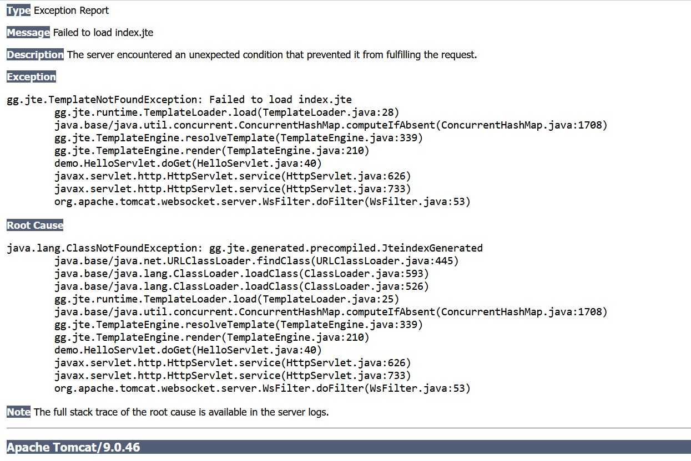

When reading from precompiled classes using below code. 
 

<code>
templateEngine = TemplateEngine.createPrecompiled(Path.of("jte-classes"),ContentType.Html);
</code>

  

	<strong>Note:</strong> The below  error is occuring 

 
  

 

 when using code resolver syntax. 

<code>
CodeResolver codeResolver = new DirectoryCodeResolver(Path.of("src/main/jte")); 
templateEngine = TemplateEngine.create(codeResolver, ContentType.Html);
</code>

  
<strong>Note:</strong> The below  error is occuring  

<code>index.jte not found (tried to load file at ${STS_INSTALLATION_LOC}\src\main\jte\index.jte)</code>

